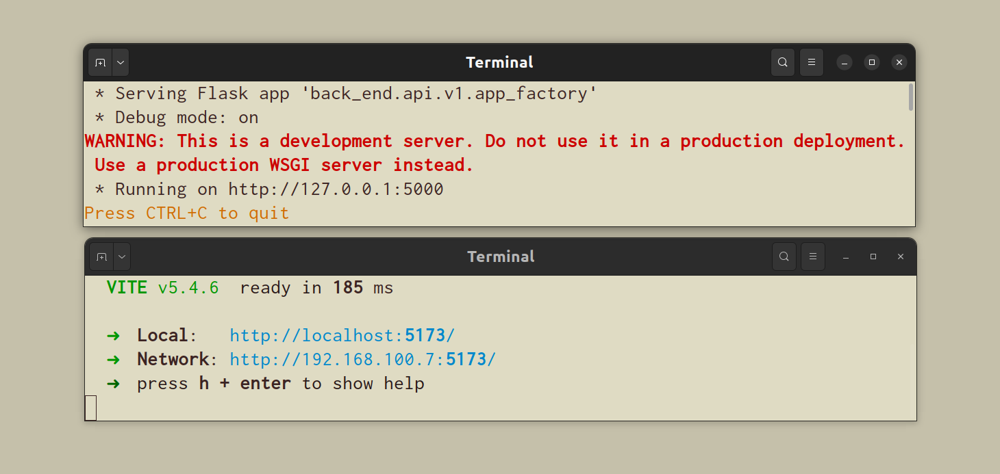

# sunema

A movie recommendation application, that uses the weather in your location to
\
recommend movies.
\
\
This was also our submission for the second round (round of 11 💻🏆) of the ALX SE Face-Off Cup
\
community competition.
\
\
Challenge name: API Innovation Challenge

---

## APIs used

### 1. Geolocation API (browser-builtin)

We use this to know the user's location, such that we can later get the weather reading
\
in that location for the application to work. The user is prompted visibly from the
\
browser, and can choose not to give their location.
\
\
Should the user decline this location request, the application then uses a [default
\
location](https://www.google.com/maps/place/Mt+Hollywood/@34.136635,-118.3998476,10.75z/data=!4m6!3m5!1s0x80c2bf7da13f1811:0xacb38675764f681!8m2!3d34.1280637!4d-118.3011874!16s%2Fg%2F1237c_vw?entry=ttu&g_ep=EgoyMDI0MDkxMS4wIKXMDSoASAFQAw%3D%3D)

### 2. The OpenWeatherMap API

We use the [OpenWeatherMap](https://openweathermap.org/) API to get the current weather
\
in the user's location (or the default location).
\
Though we fetch the complete weather details from the API, the current implementation
\
uses the temperature at said location to recommend films.
\
\
We also fetch weather icons (such as: ☁️, ⛅, ...)from the API such that we can
\
render then to the home screen along with the temperature in degrees Celsius
\
truncated to one decimal place. The icons fetched from OpenWeatherMap are actually
\
tiny `.png` files.

### 3. The Movie Database (TMDB) API

We use the [TMDB](https://www.themoviedb.org/) API for the movie-related features
\
The bulk of the application lay here, as expected.
\
\
Firstly, the connection between the temperature and the film recommended are based
\
on some internal assumptions of what we liked to see--a gloomy day may require a little
\
adventure to lighten up the day, for instance.
\
We fetch films based on genres--we use TMDB's complete (and short) list
\
of genres and genre ids.
\
\
Because the returned data often contains duplicate films, as one film can belong to
\
more than one genre, we do employ logic on the backend to pluck out those duplicates
\
before we show them on the home screen.
\
\
Currently, making the api request and getting back the data, and fetching the film posters
\
takes about 5 - 7 seconds, so in place of the would-be posters, skeleton previews are rendered
\
as the data is being fetched.

## How to install the application on a linux environment

### If you are in a hurry, open a terminal and run this command

```sh
wget https://raw.githubusercontent.com/josfam/projectquickinstall/main/sunema-install.sh && sudo chmod +x sunema-install.sh && source ./sunema-install.sh
```

After (maybe) entering your password, all you have to do is wait while the project gets setup.
\
\
After the project has been setup, you will see two terminals open automatically.
\
One is for the frontend vite server, one is for the backend flask server.
\
Keep these terminals open while you use the program
\
\
**Here's an example of the two terminal contents**
\
\

\
\
\
The command will also open a browser on your computer, where you can proceed to try the application
